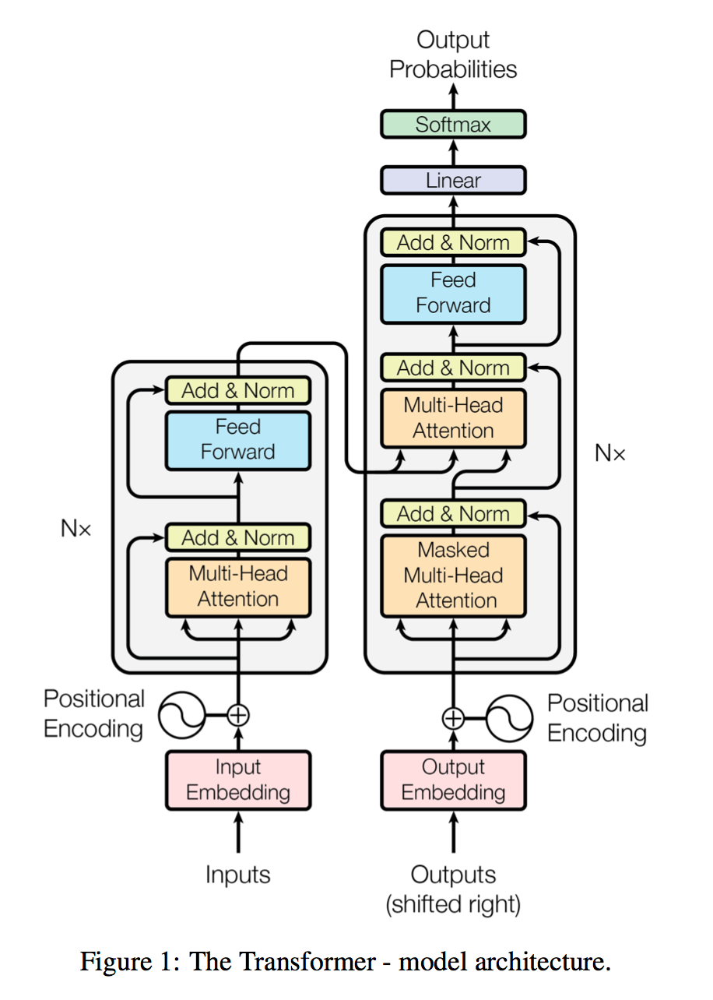

# Pytorch-Transformer
 
Machine translation model using Transformer
 
## Description
 
This is a machine translation model using Transformer's encoder and decoder with six layers of self-attention.
The text id of the source translation (x1...xi) to the encoder, and the text id to be translated (y1...y(j-1)) to the decoder, the value to be translated including the next character (y1...yi) including the next character will be output.

 
## Requirement
 
- python==3.9.7
- torch==1.10.2+cu113
- torchviz==0.0.2
 
## Usage

You can try example.py.
 
## Author
 
[@HarunoriKawano](https://twitter.com/HarunoriKawano)
mail to: harunori.kawano.business@gmail.com

## Reference
- Ashish Vaswani et al(2017). Attention Is All You Need. NeuralPS2017
- Fuwara Miyasaki. "Transformerのデータの流れを追ってみる". Qiita. 2021-08-20. https://qiita.com/FuwaraMiyasaki/items/239f3528053889847825